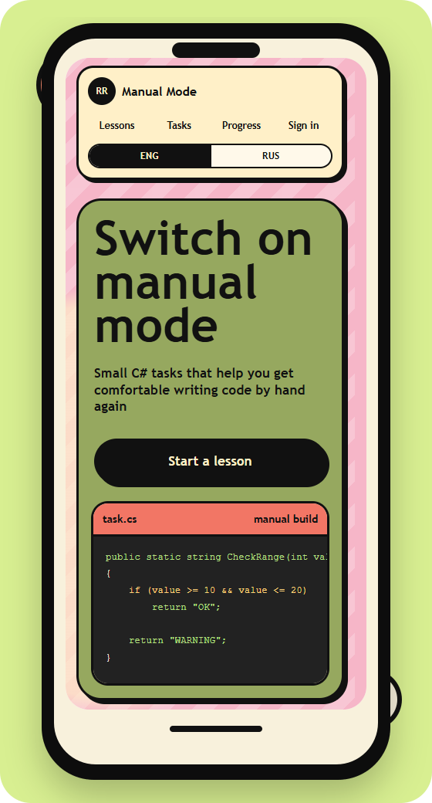

# Backend Rehab

Hands-on training app for practicing real-world backend fixes through small async C# tasks, guided hints, and behavioral tests.

The application lives in [`ruchnoy-rezhim`](ruchnoy-rezhim/): it includes the frontend, backend API, shared lesson data, and the C# runner.

## Screenshots




## Quick Start

With Docker:

```bash
cd ruchnoy-rezhim
docker compose up --build
```

Open `http://127.0.0.1:5173`.

Local development without Docker:

```bash
cd ruchnoy-rezhim/frontend/web
npm install
npm run dev:backend
npm run dev
```

## Repository Guide

See the full project README: [`ruchnoy-rezhim/README.md`](ruchnoy-rezhim/README.md).
