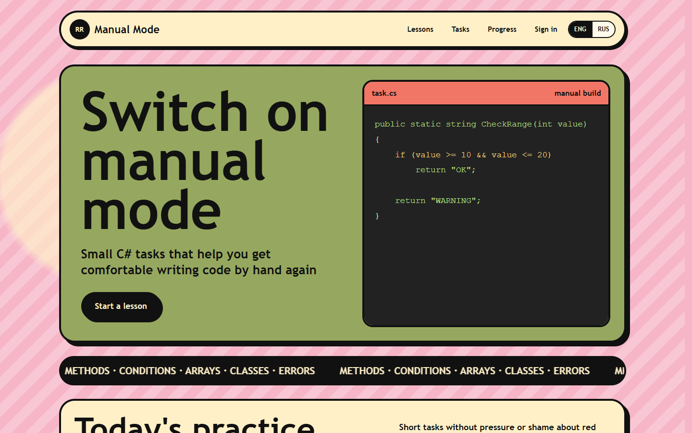
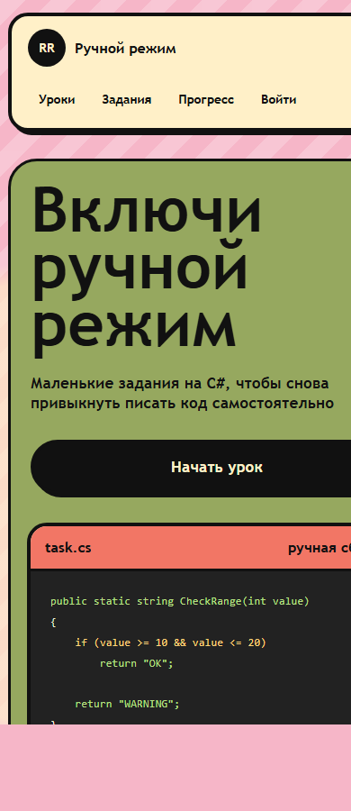

# Backend Rehab

Backend Rehab is a hands-on training app for practicing real-world backend fixes through small async C# tasks, guided hints, and behavioral tests.

It is built for developers who want to regain confidence writing code manually: no algorithm puzzles, no toy `if/for` drills, just everyday backend problems like retries, cancellation, idempotency, outbox, cache stampede, background workers, and sync-over-async bugs.

## Screenshots

### Home



### Mobile



## What It Does

- Shows a catalog of practical backend async tasks.
- Opens each task as a single editable C# file.
- Provides a checklist and learning hints for the scenario.
- Runs real behavioral tests against the submitted code.
- Returns per-test `OK` / `FAIL` feedback instead of comparing two files.
- Keeps frontend and backend responsibilities separate.

## Current Task Set

The app currently includes 10 backend tasks:

- Idempotent payment webhook
- Parallel order status refresh
- Shipping quote timeouts
- Forgotten `await` in registration
- Async cache stampede
- Background export status handling
- Transactional outbox
- Request cancellation leak
- Sync-over-async inventory endpoint
- Safe retry policy for CRM lead creation

## Architecture

```text
ruchnoy-rezhim/
  backend/
    api/
      server.mjs                  # HTTP API for lessons and submissions
    runners/
      dotnet-runner/
        CodeRehab.DotNetRunner.sln # .NET C# solution runner
    services/
      code-runner-service/
        runner/
          solutionRunner.mjs      # Node adapter that calls the .NET runner
      submission-service/
      learning-content-service/
      identity-service/
      progress-service/
      achievement-service/
  frontend/
    web/
      src/
        pages/
        components/
        data/                     # API client and shared frontend types
  shared/
    data/
      lessons.json                # task catalog used by the backend
```

The frontend does not own task data or solution checking. It calls the backend API.

The backend loads tasks from `shared/data/lessons.json` and accepts solution submissions. The Node API calls the separate .NET runner in `backend/runners/dotnet-runner`; that runner creates a temporary `.NET` console project, injects the user's C# code plus a task-specific test harness, runs restore/build/run, and returns structured test results.

## API

Backend runs on `http://127.0.0.1:5088`.

```text
GET  /health
GET  /api/lessons
GET  /api/lessons/:id
POST /api/submissions/check
GET  /api/submissions/:id
GET  /api/submissions?lessonId=:id
```

Example submission request:

```json
{
  "lessonId": "webhook-idempotency",
  "code": "public sealed class PaymentWebhookHandler { ... }"
}
```

Example response:

```json
{
  "id": "007d274d-8c9d-4d66-a819-674e8a501717",
  "lessonId": "webhook-idempotency",
  "status": "failed",
  "result": {
    "passed": 1,
    "total": 2,
    "tests": [
      {
        "name": "Duplicate webhook does not add credits again",
        "passed": true,
        "message": "OK"
      }
    ]
  }
}
```

## Local Setup

Prerequisites:

- Node.js
- npm
- .NET SDK 8+

### Docker

The fastest full-stack startup is Docker Compose:

```bash
docker compose up --build
```

Open:

```text
http://127.0.0.1:5173
```

Compose starts:

- `backend` on `http://127.0.0.1:5088`
- `frontend` on `http://127.0.0.1:5173`

The backend image includes Node.js and the .NET SDK, so C# submissions run through the same `backend/runners/dotnet-runner` solution inside the container.

Optional ports:

```bash
CODE_REHAB_FRONTEND_PORT=8080 CODE_REHAB_BACKEND_PORT=5089 docker compose up --build
```

### Local Development

Install frontend dependencies:

```bash
cd frontend/web
npm install
```

Start the backend API:

```bash
npm run dev:backend
```

Start the frontend:

```bash
npm run dev
```

Open:

```text
http://127.0.0.1:5173
```

The Vite dev server proxies `/api` to `http://127.0.0.1:5088`.

## Build

```bash
cd frontend/web
npm run build
```

Build and test the C# runner:

```bash
cd backend/runners/dotnet-runner
dotnet restore CodeRehab.DotNetRunner.sln
dotnet build CodeRehab.DotNetRunner.sln
dotnet test CodeRehab.DotNetRunner.sln
dotnet run --project src/CodeRehab.DotNetRunner/CodeRehab.DotNetRunner.csproj -- --request examples/smoke-request.json
```

Validate the Docker Compose file:

```bash
docker compose config
```

## How Checking Works

The checker is behavioral:

1. The user edits a single C# file in the browser.
2. The frontend sends the code to `POST /api/submissions/check`.
3. The backend validates the lesson id and code payload.
4. The backend starts the `.NET` runner as a separate process.
5. The `.NET` runner creates a temporary `.NET` project.
6. The runner combines:
   - the submitted C# file,
   - fake dependencies,
   - task-specific tests,
   - a small JSON result reporter.
7. `dotnet restore`, `dotnet build`, and `dotnet run` execute with timeouts.
8. The backend returns structured test results while preserving the frontend API shape.

This means a solution can pass with different implementation styles as long as the behavior is correct.

## Notes

This is a local training runner, not a production sandbox yet. It uses temporary folders and timeouts, but production deployment would still need stronger isolation, resource limits, and network restrictions.

## Roadmap

- Persistent submission history
- User accounts and progress tracking
- More backend task packs
- Better runner isolation
- Task authoring tools
- CI checks for every lesson harness
